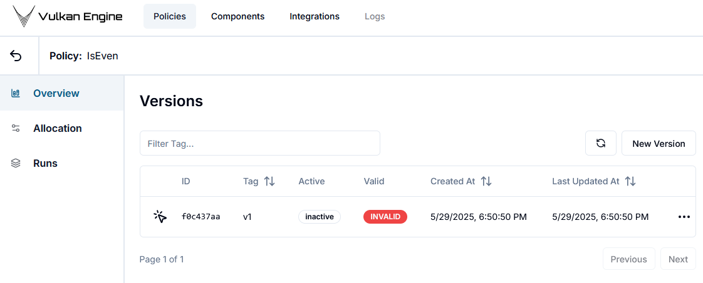
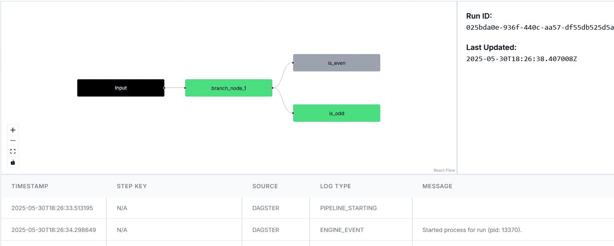

# How to create a policy

Policies are the main concept in Vulkan.
They are a workflow where you can get data from multiple sources, process it and make smart decisions.
A policy consists of

1. Input: where you get information from a user or an API to start the flow,
2. Logic: any business logic you want to create!
3. Outputs: You can create separate outputs depending on your business logic. Each output can be configured to send information to your systems, so that you can chain workflows or use them in other systems.

## Our first Policy Version

Let's start by implementing a very simple policy: it receives a number, checks if that number is even, and returns the result.

If you want to learn how to do this using our Python framework, take a look at [this notebook!](../../docs/examples/notebooks/1-simple-policy.ipynb)

### Create a Policy and a Version

We'll start by creating our "Is Even" policy and a "v1" version.

All versions start out as "inactive" and "invalid", so don't worry about that right now. 
This will change when we make some changes and then deploy our policy!




### Our first workflow

The first thing we'll do is add an input field called "number", which will be of type "int": we will receive an integer from our user.

Now we can go ahead create a couple of steps in our business rule.
To add a new step, just drag and drop the handle (the little circle) on the input node.
This will open a menu where you can select what type of node you want to add. 
We'll cover these later in detail.
Choose the "New Branch Node" option to create our first decision.


#### The Branch Node

In Vulkan, decisions are made in "branch" nodes.
In this node, you can write the business logic for your decision, and then handle each output case independently.
As only one of these will ever be used, this node creates independent branches in our decision rule.

Here, we've added the logic to check if our number is even.
This can be done in Python:

```python
if input_node["number"] % 2 == 0:
    return "even"
return "odd"
```

Note that we made sure to return strings here.
Branches are identified using string, so your decision logic *must* return strings.
For this specific case, this isn't that great, I know, but it makes it easier to keep track of big flows.

Here's what the node looks like:


#### Using our outputs

Now that we've made our first decision, we can communicate the response to the users of this rule.
A "Terminate" node indicates that at that point the flow is finished.
At this point, Vulkan sends the response back to the user.

The "return status" can be used to indicate a business status, and we use it to automatically monitor your decisions in the Policy overview.


### Running

When a Policy Version is marked as "VALID", it is ready to run!
You can create a run in three ways:

1. Using the Launcher in the interface
2. Using the `vulkan` sdk
3. Via a direct HTTP call

#### Launcher UI

In the Launcher, you just need to pass in the values you want to use for each field in the Input.
When you click "Launch", a run will be created and a new button will appear to take you to the run logs directly.




#### `vulkan` Python SDK

We currently have a basic Python SDK.
To use it, just install the `vulkan` package directly (from source, at this point) by running:

`pip install ./vulkan`

Then, to create a Run you can run:

```python
from vulkan.cli import client as vulkan
from vulkan.cli.context import Context

# Fill in the ID for the version you want to run
POLICY_VERSION_ID = ""

ctx = Context()
run_id, ok = vulkan.run.trigger_run_by_policy_version_id(
    ctx, POLICY_VERSION_ID, {"number": randint(100)}
)

vulkan.run.get_run_data(ctx, run_id)
```

## Versions and Allocation

Each policy can have multiple Versions.
Versions can be executed, A/B tested, and monitored individually.
We can "allocate" a version to make it the default version for a Policy.
This is useful so users can just call the "onboarding workflow", instead of knowing which specific version of the workflow we want them to use.

To allocate a version, go to the "Allocation" section in the policy page.
Then, select the version you want to use (or many!).
This is the same flow you would use to create an A/B testing scenario or roll back a change.

You can also deploy a version in "shadow" mode, so that it'll be run, but the response won't be sent to the users.
This is useful when you want to test or validate new versions with real workloads.

